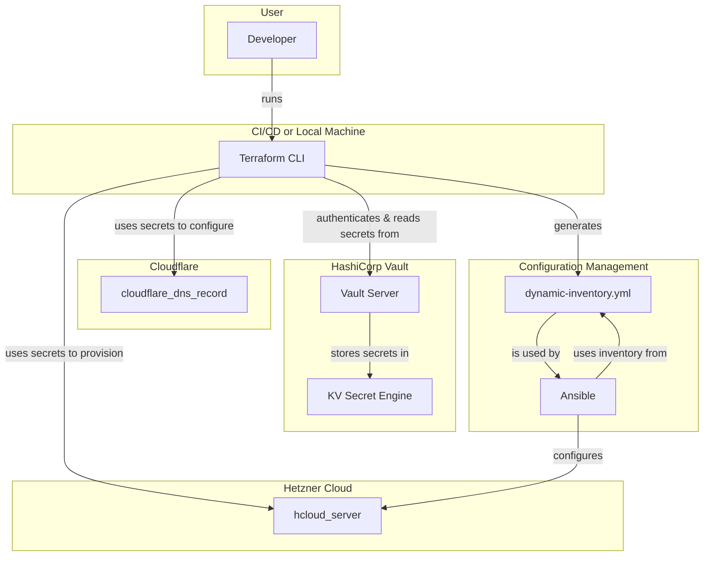

# Terraform Reference

This directory contains the Terraform configuration for provisioning and managing the infrastructure for the Blithe project.

## Overview

This Terraform setup automates the creation of servers on Hetzner Cloud, configures DNS records on Cloudflare, and generates a dynamic Ansible inventory file. It leverages HashiCorp Vault for secrets management, ensuring that sensitive information like API tokens are not hardcoded in the configuration files.

## Architecture Diagram

## File Breakdown

- **`main.tf`**: The main entrypoint for the Terraform configuration. It defines the providers, resources for creating Hetzner Cloud servers, and generates the Ansible inventory.
- **`cloudflare.tf`**: Configures the Cloudflare provider and manages DNS records for the domain.
- **`vault.tf`**: Configures the Vault provider and defines data sources to fetch secrets from Vault.
- **`inventory.tftpl`**: A template file used to generate the `dynamic-inventory.yml` for Ansible.
- **`dynamic-inventory.yml`**: The generated Ansible inventory file. This file is git-ignored.
- **`.terraform.lock.hcl`**: A lock file that pins the versions of the providers used in the project.
- **`terraform.tfstate`**: The state file that Terraform uses to track the resources it manages. This file is git-ignored.

## Providers

This configuration uses the following Terraform providers:

- **Hetzner Cloud (`hcloud`)**: To create and manage servers.
- **Cloudflare (`cloudflare`)**: To manage DNS records.
- **Vault (`vault`)**: To read secrets from HashiCorp Vault.
- **Time (`time`)**: To generate timestamps.
- **Random (`random`)**: To generate random values (e.g., passwords, prefixes).
- **Local (`local`)**: To create local files (e.g., the Ansible inventory).

## Resources

The main resources created by this configuration are:

- **`hcloud_server`**: Creates one or more virtual servers in Hetzner Cloud.
- **`hcloud_ssh_key`**: Manages an SSH key in Hetzner Cloud for accessing the servers.
- **`cloudflare_dns_record`**: Creates 'A' records for the main domain and a wildcard subdomain, pointing to the created server's IP address.
- **`local_file`**: Generates the `dynamic-inventory.yml` file from the `inventory.tftpl` template.
- **`random_id`**: Generates a random prefix for server names.
- **`random_password`**: Generates a random password for the admin user on the servers.

## Secrets Management

This project uses HashiCorp Vault to manage secrets. The following secrets are required:

- **Hetzner Cloud API Token**: Stored in Vault at `kv/hcloud/blithe`.
- **Cloudflare API Token and Zone ID**: Stored in Vault at `kv/cloudflare/aitbytes.fyi`.

The Vault provider is configured in `vault.tf`. The address of the Vault server is hardcoded, but the token should be provided via the `VAULT_TOKEN` environment variable.

## How to Use

1.  **Install Terraform**: Make sure you have Terraform installed on your machine.
2.  **Authenticate with Vault**: Set the `VAULT_TOKEN` environment variable with a valid token that has access to the required secrets.
3.  **Initialize Terraform**: Run `terraform init` to download the required providers.
4.  **Plan the changes**: Run `terraform plan` to see what resources will be created.
5.  **Apply the changes**: Run `terraform apply` to create the infrastructure.

After applying the configuration, a `dynamic-inventory.yml` file will be created in the same directory. This file can be used with Ansible to configure the newly created servers.
