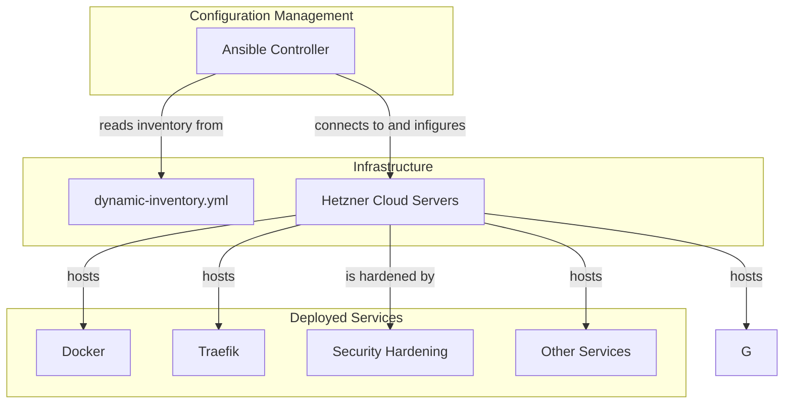

# Ansible Reference

This directory contains the Ansible configuration for setting up and managing the servers provisioned by Terraform.

## Overview

This Ansible setup is designed to configure the servers created by the Terraform configuration in the `infra-terraform` directory. It uses a role-based structure to organize tasks and deploys various services, including Docker, Traefik, Minio, .

## Architecture Diagram



## File Breakdown

- **`site.yml`**: The main playbook that orchestrates the entire configuration process. It defines a series of plays that apply roles to different hosts.
- **`ansible.cfg`**: The Ansible configuration file. It specifies the inventory file path, disables host key checking, and sets other Ansible options.
- **`roles/`**: This directory contains all the Ansible roles. Each role is a self-contained unit of automation for a specific service or configuration.
- **`group_vars/`**: This directory can contain variables that apply to specific groups of hosts defined in the inventory.

## Playbook (`site.yml`)

The `site.yml` playbook is divided into multiple plays, each targeting specific hosts and applying a set of roles:

1.  **Initial Setup**: Runs as the `root` user to perform initial security hardening on the `aitbytes.fyi` host.
2.  **System Configuration**: Installs Docker on the `aitbytes.fyi` host.
3.  **Configure Traefik**: Deploys and configures the Traefik reverse proxy.
4.  **Service Deployment**: A series of plays that deploy various services, including:
    -   Anki Sync Server
    -   Minio

    -   Wordpress
    -   NSD
    -   Copyparty
    -   Browserless
    -   SeaweedFS
    -   Vault
    -   Adminer
    -   Watchtower

## Roles

The configuration is modularized into the following roles:

-   `security`: Basic security hardening.
-   `docker`: Installs Docker and Docker Compose.
-   `traefik`: Sets up the Traefik reverse proxy.
-   `anki-sync-server`: Deploys an Anki sync server.
-   `minio`: Deploys a Minio S3-compatible object storage server.

-   `wordpress`: Deploys a WordPress instance.
-   `nsd`: Deploys the NSD authoritative DNS server.
-   `copyparty`: Deploys a file sharing service.
-   `browserless`: Deploys a headless browser service.
-   `seaweedfs`: Deploys a distributed file system.
-   `vault`: Deploys a HashiCorp Vault server.
-   `adminer`: Deploys a database management tool.
-   `watchtower`: Deploys Watchtower to automatically update Docker containers.

## How to Use

1.  **Provision Infrastructure**: First, use the Terraform configuration in the `../infra-terraform` directory to create the servers. This will also generate the `dynamic-inventory.yml` file.
2.  **Install Ansible**: Make sure you have Ansible installed on your machine.
3.  **Run the Playbook**: From the `config-ansible` directory, run the following command:

    ```bash
    ansible-playbook site.yml
    ```

You can also run specific parts of the playbook by using tags:

```bash
ansible-playbook site.yml --tags "docker,traefik"
```
